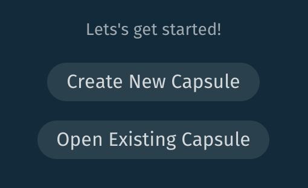
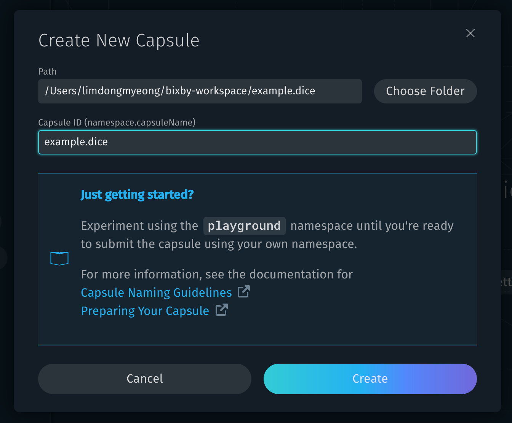
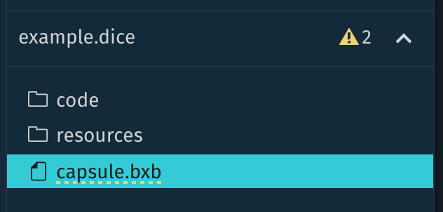

# Bixby


## 1. 시작하기

#### 캡슐 생성하기

메뉴의 `Create New Capsule` 을 눌러 캡슐 생성






#### capsule ID에 대하여

> <*namespace*>.<*name*> 의 구조이다 namespace에 들어갈 수 있는 단어는 다음과 같다.

- `'unique name'` : 개발하는 팀 혹은 회사에서 쓸 이름으로 bixby 개발환경에서 유일한 값을 가진다. 사용하려면 Bixby developers에서 등록해 주어야 한다.
- `playground` : 개인이 개발해보고 테스트해볼 수 있는 공간으로 정의한다. 배포및 실제 디바이스에서의 실행이 불가능하다.
- `example` : bixby developers의 여러 예제들을 위한 공간이다.


id를 지정하고 나면 다음과 같이 폴더가 생성되고 `capsule.bxb` 파일이 열려 있다.



```
// capsule.bxb
capsule {
  id (example.dice)
  version (0.1.0)
  format (3)
  targets {
    target (bixby-mobile-en-US)
  }
  runtime-flags {
    support-halt-effect-in-computed-inputs
  }
}
```

- Version : capsule의 버전을 나타낸다.
- format : capsule간의 호환성을 위한 capsule format의 버전을 나타낸다.