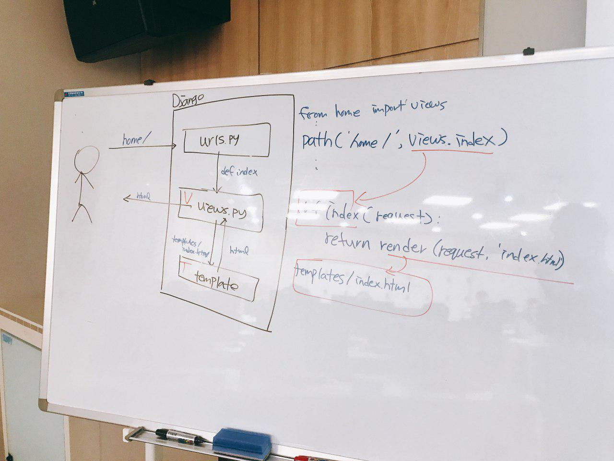

# Django

> 19.02.11 내용

MVC (Model View Controller)를 MTV (Model Template View)라고 부름.

`프로젝트` 안에 여러 `app`이 있는 구조

`app` 안에는 M, T, V가 하나씩 들어있다.


### 1. 시작하기

#### 1. 환경설정

 `c9 환경설정` 을 따라 한후

```bash
$ pyenv virtualenv django-venv
```

```bash
$ pyenv local django-venv
```


완료 후 아래 명령어 입력

```bash
$ pip install django
```

아래의 명령어를 입력하면 django_intro 폴더가 생성된다.

```bash
$ django-admin startproject django_intro
```

> `startproject`를 할때만 `django-admin`이라는 이름으로 `django_intro`폴더를 생성한다.

`django_intro`폴더가 생성이 되는데 그 폴더가 앞으로 프로젝트를 관리할 폴더가 된다.

```
workspacename/
	django_intro/
		django_intro/
			__init__.py
			settings.py
			urls.py
			wsgi.py
		db.sqlite3
		manage.py
	README.md
	req.txt
```


#### 2. 서버 실행하기

`settings.py`에서 ALLOWED_HOST의 내용을 ['*']로 바꿔준다.	

```bash
ALLOWED_HOST=['*']
# c9에서는 host - 0.0.0.0, port - 8080만 활용할 수 있기 때문에 위와 같이 설정한다.
```

해당 폴더로 접근 후

```bash
cd django_intro/
```

아래의 명령어를 입력해 서버 실행

```bash
$ python manage.py runserver 0.0.0.0:8080
```

앞으로 모든 장고 명령어는 프로젝트를 만들 때를 제외하고 `python manage.py`를 활용한다. 따라서 반드시 `pwd`와 `ls`를 통해 현재 bash(터미널)위치를 확인하자!

실행한 화면


#### 3. 추가설정

필요없는 파일 git에 올리지 않게 설정

[gitignore](https://www.gitignore.io/)에서 django검색 후 모두 복사

```
https://www.gitignore.io/api/django
```

```bash
$ git init
```

```bash
$ vi .gitignore
```

후 내용 복사


### 2. Hello, Django

> Django 프로젝트는 여러가지 app의 집합이다.
>
> 각각의 app은 MTV 패턴으로 구성되어 있다.
>
> M (Model) : 어플리케이션의 핵심 로직의 동작을 수행한다.
>
> T (Template) : 사용자에게 결과물을 보여준다.
>
> V (View) : 모델과 템플릿의 동작을 제어한다. (모델의 상태를 변경하거나 값을 가져오고, 템플릿에 값을 전달하기 등)
>
> **일반적으로 MVC패턴으로 더 많이 사용된다.**

#### 1. 기본 로직

앞으로 우리는 1. 요청 url 설정(`urls.py`) 2. 처리 할 view 설정(`view.py`) 3. 결과 보여줄 template 설정(`templates/`)으로 작성할 것이다.

##### 1-1. setting.py 설정

base_dir 프로젝트 dir 설명

debug = true는 디버그

allowed_host는 호스트 설정

INSTALLED_APPS는 많이 보게 될 것.(마지막에도 ,를 쓴다는 것을 기억해두자-트레일링이라고 함(이어서 쓴다는 의미?))

TEMPLATES - 장고가 구동하기 위해 필요한 설정들을 만들어 줌

DATABASES - DB설정

MIDDLEWARE - 서버와 요청 사이의 무언가

LANGUAGE_CODE = 'ko-kr'로 설정해주자

TIME_ZONE = 'Asia/Seoul'

##### 1-2. urls.py

flask에서 @app.route로 했던 내용들이 이제 이곳에 들어간다.

view.py를 urls.py에 등록한다.

```python
from home import views
urlpatterns = [
    path('home/', views.index)
    # 요청이 home/으로 오면, views의 index함수를 실행시킨다.
]
```

위의 코드를 한 세트라고 생각하자.

##### 1-3. app 시작하기

```bash
$ python manage.py startapp home
```

을 입력하면 home이라는 폴더가 생성된다.

##### 1-4. view.py

```python
# home/views.py
from django.shortcuts import render, HttpResponse

# Create your views here.
def index(request):
    return HttpResponse('hello, django!')
```

주의할 점은 선언된 함수에서 `request`를 인자로 받아야 한다.

- request는 사용자(클라이언트)의
- Django 내부에서 해당 함수를 호출하면서 정보를 넘겨주기 때문에 반드시 명시해줘야 한다.

##### 1-5. Template(MTV-V)

> Django에서 활용되는 Template은 DTL(Django Template Language)이다.
>
> Jinja2와 문법이 유사하다.

1. 요청 url 설정

   ```python
   path('home/dinner/', views.dinner)
   ```

2. view 설정

   ```python
   def dinner(request):
       box = ['치킨', '밥', '피자']
       pick = random.choice(box)
       return render(request, 'dinner.html', {'dinner': pick})
   ```

   - Template을 리턴하려면, `render`를 사용하여야 한다.
     - `request` (필수)
     - `template 이름` (필수)
     - `template 변수` (선택) : 반드시 `dictionary` 타입으로 구성해야 한다.

3. Template 설정

   ```bash
   $ mkdir home/templates
   ```

   ```bash
   $ touch home/templates/dinner.html
   ```

   ```django
   < !-- home/templates/dinner.html -->
   <h1> {{dinner}} </h1>
   ```




### 3. Variable Routing

##### 1. url 설정

```python
path('home/you/<name>', views.you),
path('home/cube/<int:num>', vies.cube),
```

##### 2. view 파일 설정

```python
def you(request, name):
    return render(request, 'you.html', {'name': name})
```

##### 3. 템플릿 파일 설정

```django
<h1> {{ name }}, 안녕!! </h1>
```


### 4. Form data

##### 1. ping.html

###### 1.1 요청 url 설정

```python
path('home/ping/', views.ping)
```

###### 1.2 view 설정

```python
def ping(request):
    return render(request, 'ping.html')
```

###### 1.3 template 설정

```django
<form action='/home/pong/'>
    <input name="message" type="text">
    <input name="submit">
  
</form>
```

##### 2. pong.html

###### 2.1 요청 url 설정

```python
path('home/pong/', views.pong)
```

###### 2.2 view 설정

```python
def pong(request):
    messsage = request.GET.get('message')
    return render(request, 'pong.html', {'message': message})
```

###### 2.3 template 설정

```html
<h1>{{ message }}</h1>
```

##### 3. POST 요청 처리

###### 3.1 요청 FORM 수정

```django
<form action="/home/pong/" method="POST">
    
</form>
```

###### 3.2 view 수정

```python
def pong(request):
    message = request.POST.get('message')
```

- `csrf_token`은 보안을 위해 django에서 기본적으로 설정되어 있는 것이다.
  - form을 통해 POST 요청을 보낸다는 것은 데이터베이스에 반영되는 경우가 대부분인데, 해당 요청을 우리가 만든 정해진 form에서 보내는지 검증하는 것.
  - 실제로 input type hidden으로 특정한 hash값이 담겨 있는 것을 볼 수 있다.
  -  `settings.py`에 `MIDDLEWARE` 설정에 보면 csrf 관련된 내용이 설정된 것을 볼 수 있다.


### 5. Static file 관리

> 정적 파일(images, css, js)을 서버 저장이 되어 있을 때, 이를 각각의 템플릿에 불러오는 방법

#### 디렉토리 구조

디렉토리 구조는 `home/static/home/` 으로 구성된다.

이 디렉토리 설정은 `settings.py` 의 가장 하단에 `STATIC_URL` 에 맞춰서 해야한다. (기본이 `/static/`)

1. 파일 생성

   `home/static/home/images/1.jpg`

   `home/static/home/stylesheets/style.css`

2. 템플릿 활용

   ```django
   
   
   
   <link rel="stylesheets" tyle="text/css" href="">
   
   
   
   
   ```

   


### 6. URL 설정 분리

> 위와 같이 코드를 짜는 경우에, `django_intro/urls.py` 에 모든 url 정보가 담기게 된다.
>
> 일반적으로 Django 어플리케이션에서 url을 설정하는 방법은 app 별로 `urls.py` 를 구성하는 것이다.

1. `django_intro/urls.py`

   ```python
   from django.contrib import admin
   from django.urls import path, include
   
   urlpatterns = [
       path('admin/', admin.site.urls),
       path('home/', include('home.urls')),
   ]
   ```

   - `include`를 통해 `app/urls.py`에 설정된 url을 포함한다.

2. `home/urls.py`

   ```python
   from django.urls import path
   # views는 home/views.py
   form . import views
   urlpatterns = [
   	path('', views.index),
   ]
   ```

   - `home/views.py` 파일에서 `index`를 호출하는 url은 `http://<host>/` 가 아니라 `http://<host>/home/`이다.

### 7. Template 폴더 설정

##### 디렉토리 구조

디렉토리 구조는 `home/templates/home/` 으로 구성된다.

디렉토리 설정은 `settings.py`의 `TEMPLATES` 에 다음과 같이 되어 있다.

```PYTHON
TEMPLATES = [
    {
        'BACKEND': 'django.template.backends.django.DjangoTemplates',
        'DIRS': [os.path.join(BASE_DIR, 'django_intro', 'templates')],
        'APP_DIRS': True,
        'OPTIONS': {
            'context_processors': [
                'django.template.context_processors.debug',
                'django.template.context_processors.request',
                'django.contrib.auth.context_processors.auth',
                'django.contrib.messages.context_processors.messages',
            ],
        },
    },
]
```

- `DIRS` : templates를 커스텀하여 경로를 설정할 수 있다.

  - 경로 설정

    ```python
    os.path.join(BASE_DIR, 'django_intro', 'templates')
    #=> PROJECT1/django_intro/templates/
    ```

- `APP_DIRS` : `INSTALLED_APPS` 에 설정된 app의 디렉토리에 있는 `templates`를 템플릿으로 활용한다. (TRUE)

1. 활용 예시

   ```python
   # home/views.py
   def index(request):
       return render(request, 'home/index.html')
   ```

   ```
   home
   ├── __init__.py
   ├── __pycache__
   │   ├── __init__.cpython-36.pyc
   │   ├── admin.cpython-36.pyc
   │   ├── models.cpython-36.pyc
   │   ├── urls.cpython-36.pyc
   │   └── views.cpython-36.pyc
   ├── admin.py
   ├── apps.py
   ├── migrations
   │   ├── __init__.py
   │   └── __pycache__
   │       └── __init__.cpython-36.pyc
   ├── models.py
   ├── templates
   │   ├── home
   │   └── index.html
   ├── tests.py
   ├── urls.py
   └── views.py
   ```

   