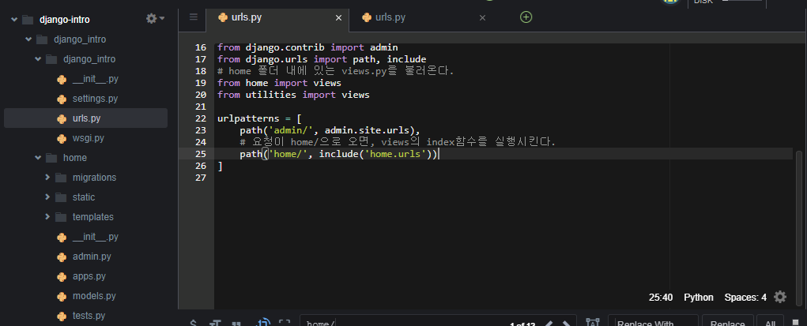

# Django template

[공식 홈페이지](https://docs.djangoproject.com/en/2.1/ref/templates/language/)

## 1. 반복문 (참고: [built-in filter reference)](https://docs.djangoproject.com/en/2.1/ref/templates/builtins/#ref-templates-builtins-filters)

##### 1.1 forloop.first

첫 번째 항목에 대해서만 실행한다.

```html

    
        <p>짜아아장면</p>
    
        <p>{{ menu }}</p>
    

<hr>
```

짜아아장면

짬뽕

탕수육

양장피

---

##### 1.2 forloop.counter

```html

    {{ forloop.counter }}
    
        <p>짜아아장면</p>
    
        <p>{{ menu }}</p>
    

<hr>
```

1

짜아아장면

2

짬뽕

3

탕수육

4

양장피

---

##### 1.3 empty

```html

    <p>{{ user }}</p>
    
        <p>지금 가입된 유저가 없습니다.</p>

```


## 2. 조건문

##### 2.1 기본 형식

```html
<p>조건문</p>

    <p>짜장면은 고추가루 없이 못 먹지!</p>

```


## 3. Length filter

##### 3.1 기본 형식

```html

    
        <p>글씨가 너무 길어요</p>
    
        <p>{{ message }}</p>
    

```

apple

글씨가 너무 길어요

글씨가 너무 길어요

mango

---


## 4. Lorem ipsum

> %를 쓰는 것에 주의하자

##### 4.1 기본 형식

```html

```

Lorem ipsum dolor sit amet, consectetur adipisicing elit, sed do eiusmod tempor incididunt ut labore et dolore magna aliqua. Ut enim ad minim veniam, quis nostrud exercitation ullamco laboris nisi ut aliquip ex ea commodo consequat. Duis aute irure dolor in reprehenderit in voluptate velit esse cillum dolore eu fugiat nulla pariatur. Excepteur sint occaecat cupidatat non proident, sunt in culpa qui officia deserunt mollit anim id est laborum.

##### 4.2 w태그

갯수로 단어를 추출한다

```html

```

lorem ipsum dolor sit amet

##### 4.3 random태그

랜덤한 위치의 단어를 추출한다.

```html

```

placeat quo rem illo

##### 4.4 p태그

문단으로 추출한다

```html

```

Lorem ipsum dolor sit amet, consectetur adipisicing elit, sed do eiusmod tempor incididunt ut labore et dolore magna aliqua. Ut enim ad minim veniam, quis nostrud exercitation ullamco laboris nisi ut aliquip ex ea commodo consequat. Duis aute irure dolor in reprehenderit in voluptate velit esse cillum dolore eu fugiat nulla pariatur. Excepteur sint occaecat cupidatat non proident, sunt in culpa qui officia deserunt mollit anim id est laborum.

Aliquid ea exercitationem, quidem assumenda accusamus, facilis tenetur adipisci fugit laudantium, necessitatibus autem nulla eaque nisi maxime id nemo. Quia maxime illo unde similique ea soluta ratione eveniet, facilis minima dolorum aspernatur tempore et blanditiis non laborum dolorem, sed quidem quasi voluptatem quo? Rem quod mollitia laudantium.

Perferendis id rem, eligendi similique quod commodi possimus blanditiis quisquam doloremque illo exercitationem rerum quo, corporis ab pariatur assumenda sunt maiores quas iste magnam numquam. Molestiae commodi libero ratione esse reiciendis, aut laudantium perspiciatis doloribus sit debitis incidunt pariatur unde, atque optio magnam sunt quidem molestiae distinctio odit?


## 5. 글자수 제한하기(truncate)

##### 5.1 words 태그

숫자만큼의 단어만 추출한다.

```python
my_sentence = ['Life is short, you need python']
```

```html
<p>{{ my_sentence|truncatewords:3 }}</p>
```

Life is short, ...

##### 5.2 chars 태그

**' ...'을 포함하여 글자를 추출한다**

```html
{{ my_sentence|truncatechars:4 }}
```

...


## 6. 글자 관련 필터

##### 6.1 lower

python의 lowercase()와 같이 동작한다.

```html
{{ 'ABC'|lower }}
```

abc

##### 6.2 title

앞의 문자를 대문자로

```html
{{ my_sentence|title }}
```

Life Is Short, You Need Python!

##### 6.3 capfirst

맨 앞글자만 대문자로

```html
{{ 'abc def, hi'|capfirst }}
```

Abc def, hi

##### 6.4 글자수 출력

```html
{{ 'asbasd'|length }}
```

6

##### 6.5 Random

random.choice와 같은 동작을 한다.

```html
{{ my_list|random }}
```

짬뽕


## 7. 연산

> django-mathfilter 쓰면 추가적으로도 가능하긴 함.

##### 7.1 add

```html
{{ 4|add:6 }}
```


## 8. 날짜표현

> now는 기본적으로 내장되어 있어 그냥 써도 됌
>
> 날짜를 계산하거나 하고 싶으면 datetime을 import해서 사용.

##### 8.1 기본 형식

```html
{{ now }} <br>
<br>
<br>
<br>
<br>
```

2019년 2월 12일 11:23 오전 
th11+0900RKST_화요일오전KST2월KST02월2월_2월+0900R2월오전
2019년 2월 12일 11:23 오전
2019-2-12.
2019년 2월 12일

##### 8.2 사용자 지정

datetimenow는 import 해야함

```html
{{ datetimenow|date:"SHORT_DATE_FORMAT" }}

```

2019년 02월 12일 (화요일) 11:24

2019-2-12.


## 9. 기타

##### 9.1 url로 만들기

```html
{{ 'google.com|urlize }}
```

[google.com](http://google.com/)


# Django Static

## 1. 사진 업로드

##### 1.1 기본 형식

app폴더에 static폴더를 만들고 그 안에 사진파일을 넣는다.

```html


    
    

```


## 2. css 적용

> settings.py에 STATIC_URL이 있어서 가능하다.

##### 2.1 style.css 생성

static폴더에 style.css 생성

##### 2.2 base.html 수정

```html

```

##### 2.3 html 수정

```html

<link rel="stylesheet" href="" type="text/css" />

```


# App 2개 쓰기

### 1. 설정하기

app생성 명령어로 새로운 app 생성.

가장 상위의 urls의 내용을 분리한다.




오류나는게 많으니 이것저것 수정해줘야함. 경로라던가..